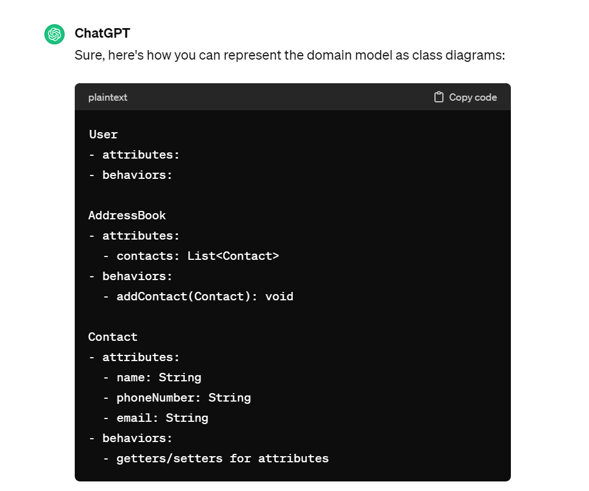
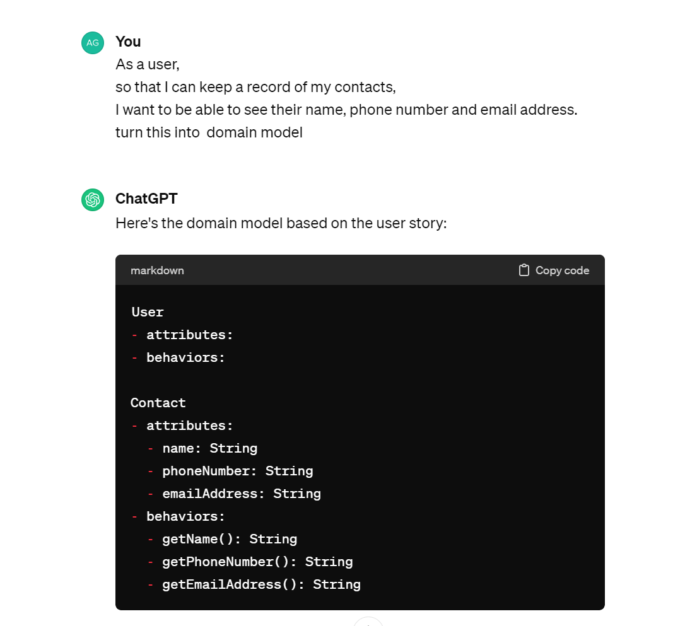
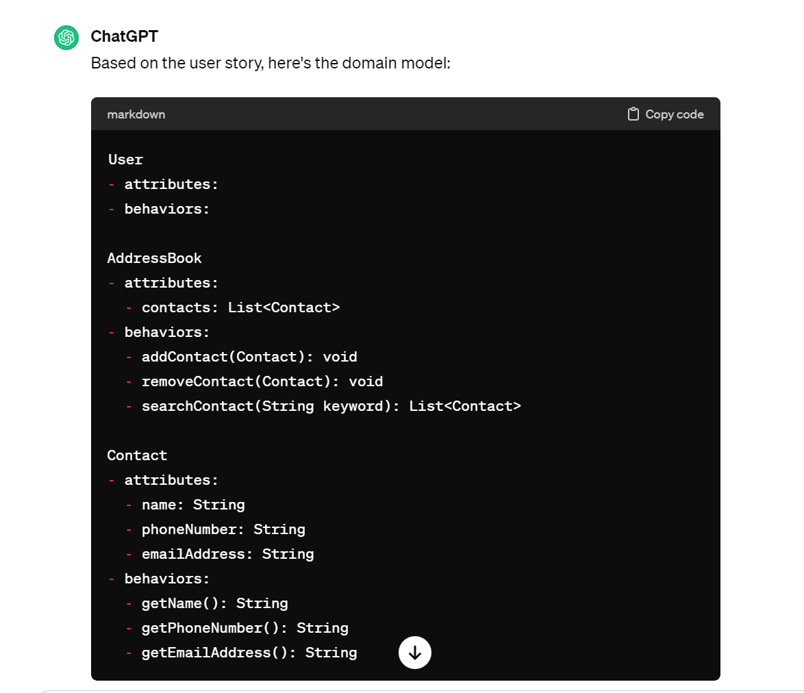
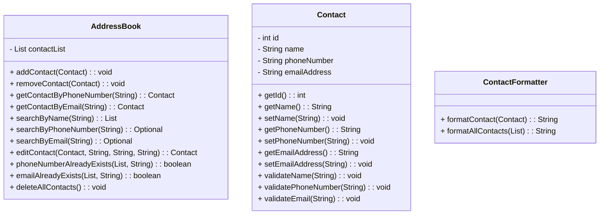

# Domain Models, Class Diagrams and Test Plan

# User Story 1:
 As a user, 
 so that I can keep a recore of my contacts, 
 I want to be able to add a contact to address book. 

## Domain model 1
Created with the use of chatgpt: 

AddressBook
- attributes:
 - contacts: List<Contact>
- behaviors:
 - addContact(Contact): void

Contact
- attributes:
 - name: String
 - phoneNumber: String
 - email: String
- behaviors:
 - getters/setters for attributes
 - 
### Test 1:
- Should contact object to contactList
- Disallows duplicate phone numbers
- Disallows duplicate email addresses

# User Story 2:
As a user, 
so that I can keep a record of my contacts, 
I want to be able to see their name, phone number and email address.

## Domain model 2
Using chat get the following domain model could be created:

Contact 
- attributes:
 - name: String
 - phoneNumber: String
 - emailAddress: String
- behaviors:
 - getName(): String
 - getPhoneNumber(): String
 - getEmailAddress(): String

ContactFormatter
- formatAllContacts(List<Contact> contactList): String

### Test 2:
- Displays all contacts from contactList

# User Story 3:
As a user, 
so that I can find the correct contact, 
I want to be able to search for their details by contact name and have the results displayed.

## Domain model 3

AddressBook
- contacts: List<Contact>
- searchByName(String name): List<Contact>

Contact
- name: String

ContactFormatter

### Test 3:

# User Story 4:
As a user, 
so that I can keep my address book up to date, 
I want to be able to remove a contact from my address book.

## Domain model 4

AddressBook
 - contacts: List<Contact>

 - addContact(Contact): void
 - removeContact(Contact): void

Contact
 - name: String
 - phoneNumber: String
 - emailAddress: String

### Test 4:
- testRemovesContactFromAddressBookReturns0ForAddressBookSize

# User Story 5:
As a user, 
so that my address book is up to fate
I want to ba able to edit my addressbook

## Domain model 5

AddressBook

 - contacts: Set<Contact>

 - addContact(Contact): void
 - removeContact(Contact): void
 - getContactByPhoneNumber(String phoneNumber): Contact
 - getContactByEmail(String emailAddress): Contact
 - editContact(contact: Contact, newName: String, newPhoneNumber: String, newEmail: String): void

### Test 5:
- testEditContactWillNotSavesContactsIfEmailAlreadyExists
- edits contact but disallows changing to telephone number that already exists
- testEditContactReturnsNullWhenEditingWithNullDetails

# User Story 6:
As a user, 
so that I know how big my social network is, 
I want to be able to view all contacts in the address book. 

## Domain model 6

AddressBook
- contacts: List<Contact>
+ getAllContacts(): List<Contact>

### Test 6:
- testDisplaysAllContactsFromContactList()

# User Story 7:
As a user, 
so that I can find the contact I want, 
I should be able to search for a contact by phone number and have the results displayed

## Domain model 7

AddressBook
- contacts: List<Contact>
+ searchContactByPhoneNumber(String phoneNumber): Contact

### Test 7:
-testSearchesContactByPhoneNumberReturnsContact()

# User Story 8:
As a user, 
so that I can find the contact I want, 
I should be able to search for a contact by email address and have the results displayed

## Domain model 8
AddressBook
- contacts: List<Contact>
- searchContactByEmail(String emailAddress): Contact

### Test 8:
testSearchesContactByEmailNumberReturnsContact()

# User Story 9:
As a user,
so that I can find the contact I want I should be able to search for a contact by name, 
phone number or email address and have the results displayed in alphabetical order

## Domain model 9

# User Story 10:
As a user, 
so that I can have a fresh start, 
I want to be able to delete all contacts at once, confirming that they want to do this before proceeding

## Domain model 10

AddressBook
 - contacts: List<Contact>

 + removeAllContacts(): void

### Test 10:
- testDeleteAllContactsRemovesAllContactsFromAddressBook

