# Use of gen AI

In this project chat gsp was used to assist with aspect of the project creation, testing and debugging.

# Coding:
- Modyfying regex to obtain desired condition:
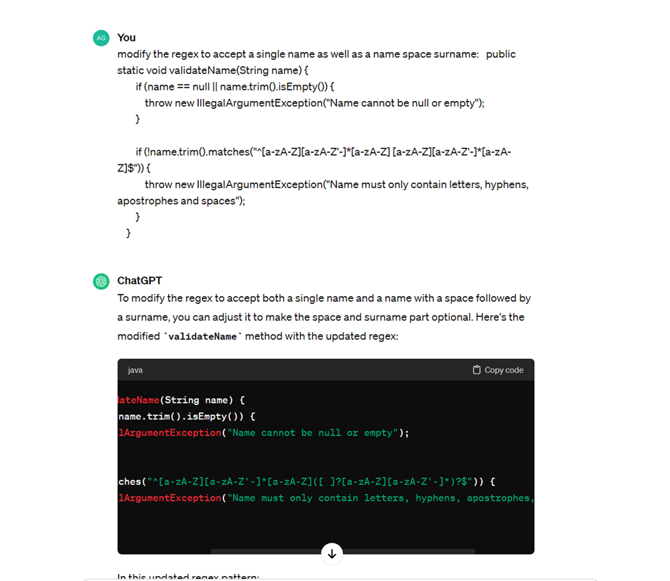

# Testing:
## Phone number validation testing:
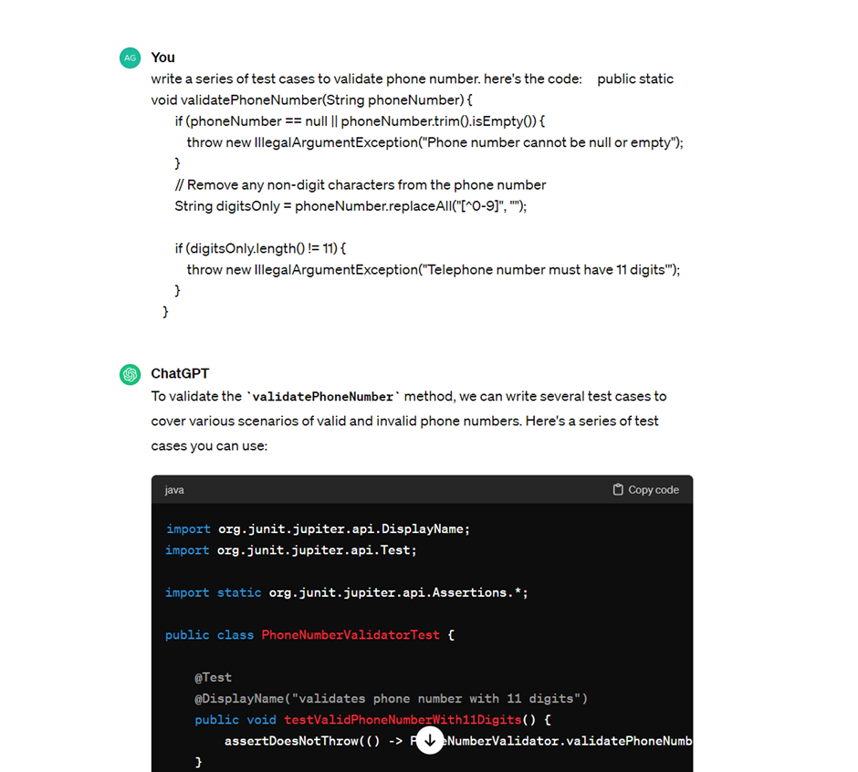
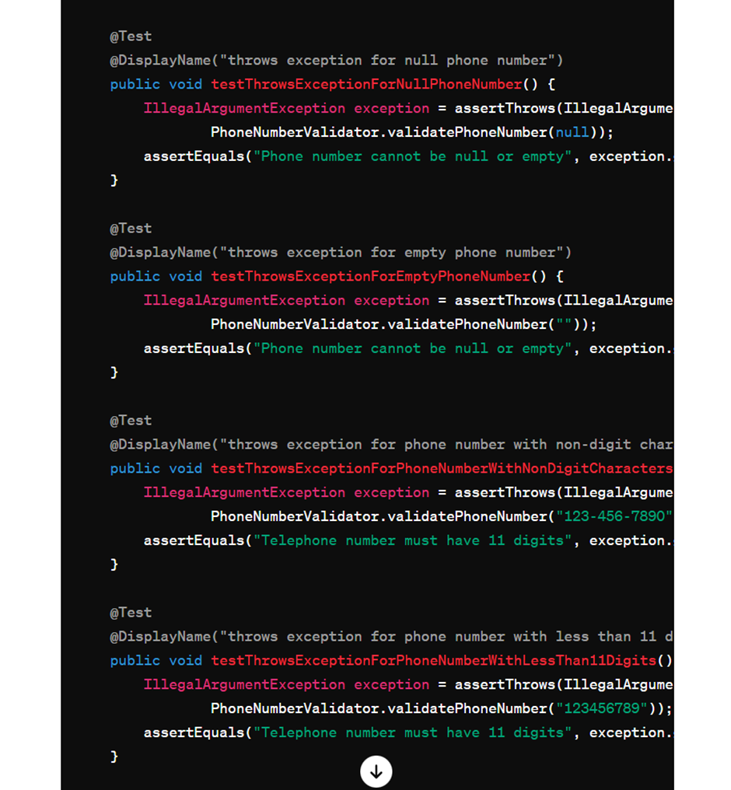
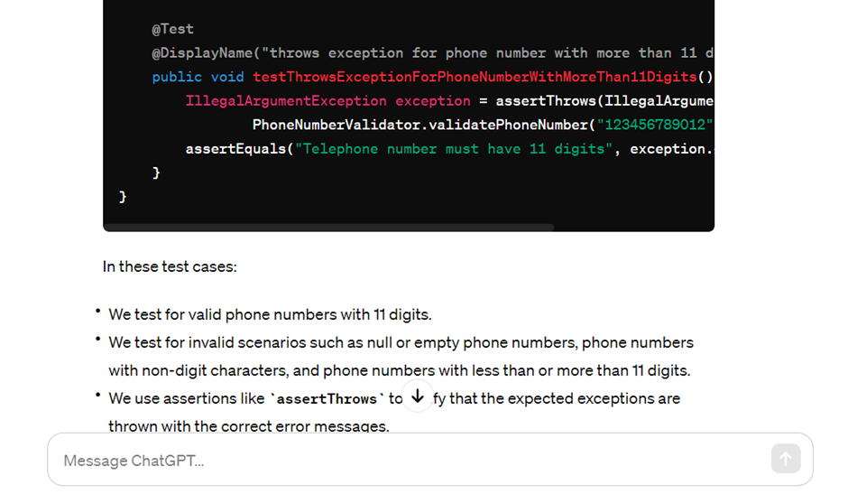

## Valide name suggestions:
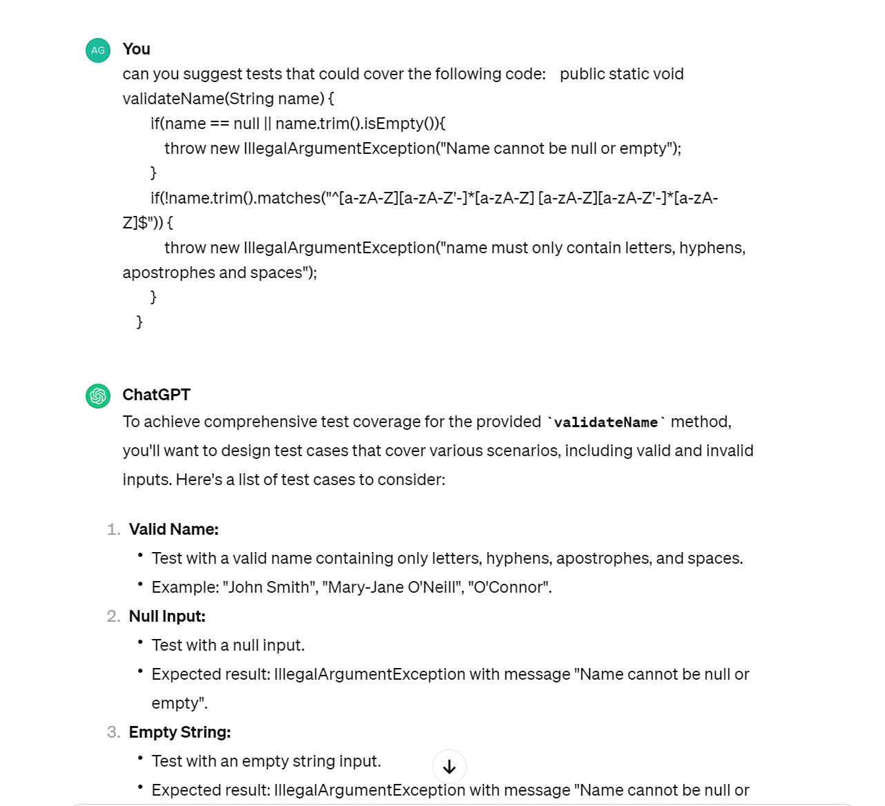
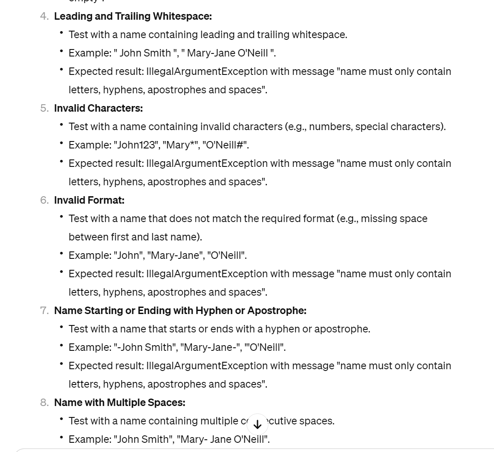
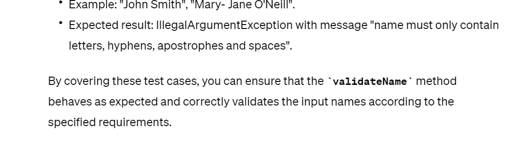

## Email address validation testing:
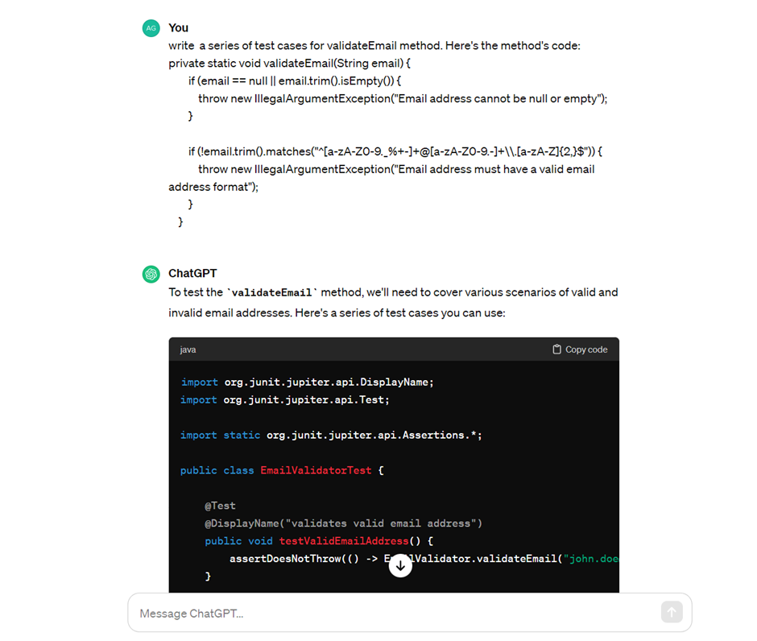
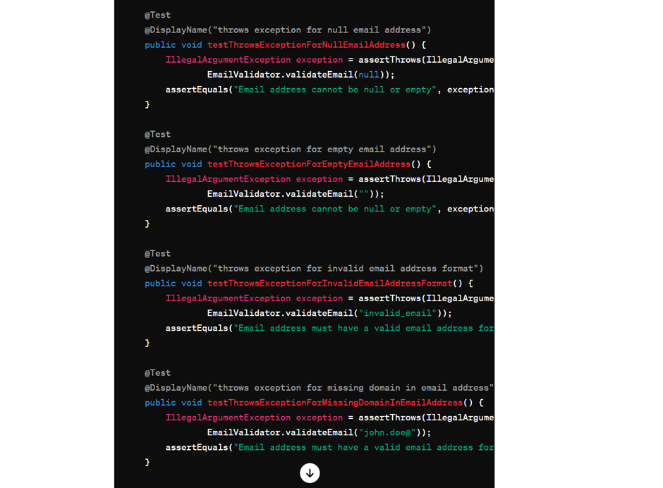
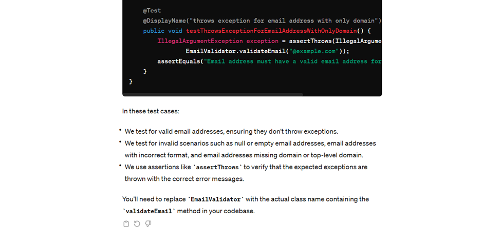

# Debugging:
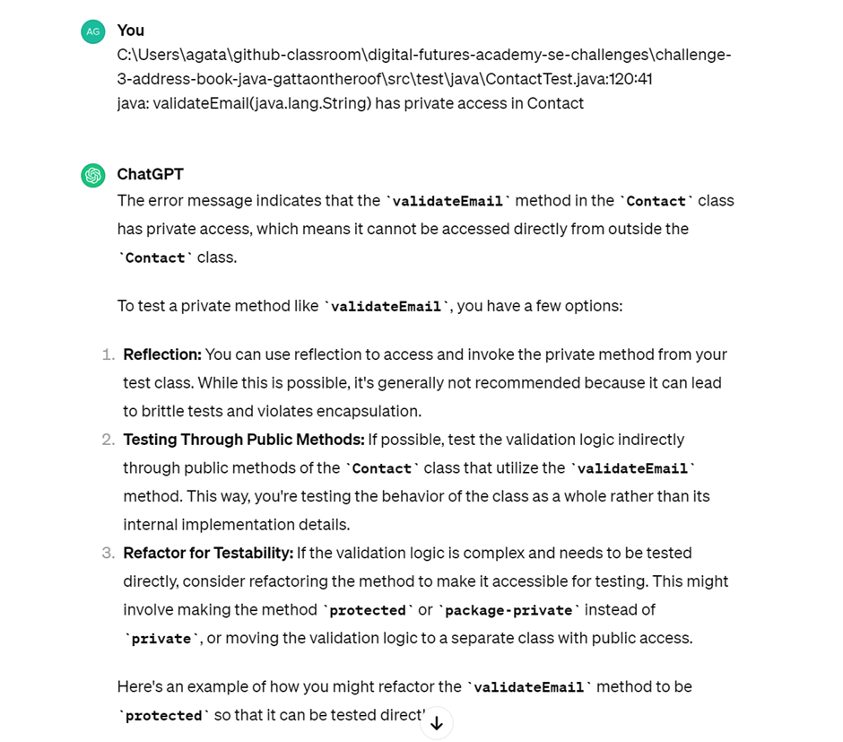
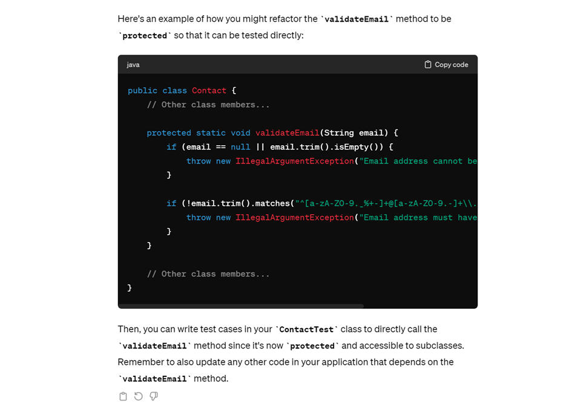

